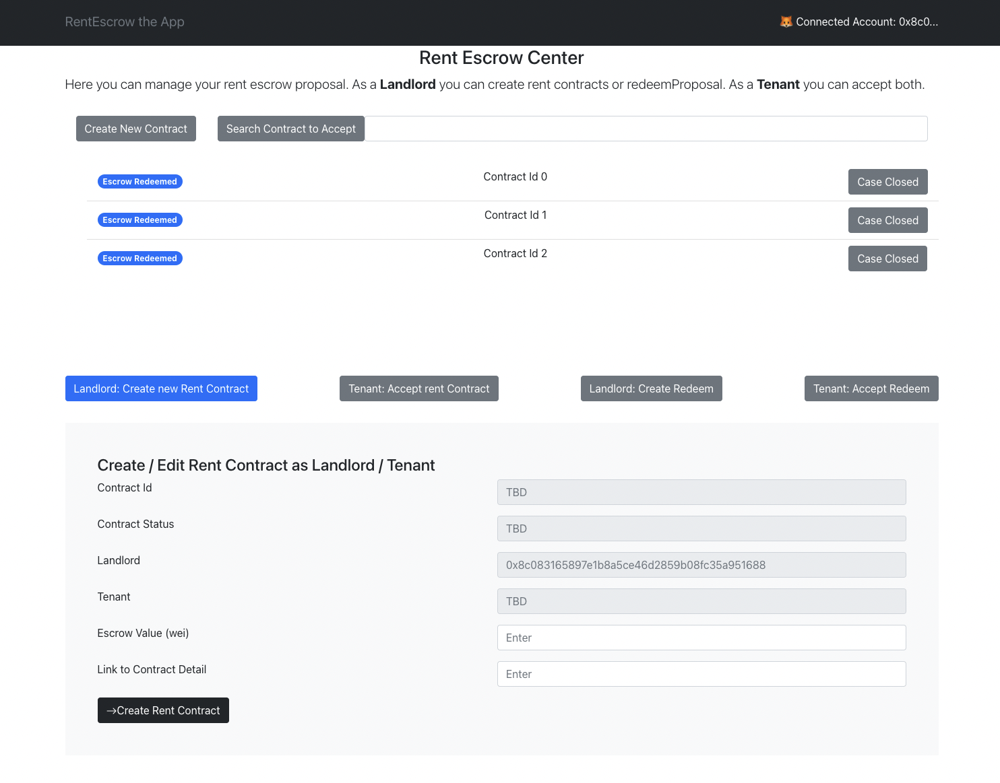

# rentEscrow

Millions of people are living in a rent, they usually pay an escrow, that gets paid back after certain conditions are met. This escrow usually remains with the homeowner, who decides if conditions were met and returns the escrow. We want to bring more fairness to the process by holding the escrow in neutral smart contract

### High Level Mechanism

1) Tenant and Landlord agree upon a social contract, which among others defines length of rental, escrow amount and conditions of escrow to be returned.

2) They turn their social contract into smart contract. Tenant transfers escrow into the smart contract

3) After contract ends conditions are evaluated

4a Happy Path) Parties agree on the evaluation and 0 to 100% of escrow is returned by the smart contract to tenants address

4b Unhappy Path) Parties don’t agree on evaluation and dispute resolution is called in

### High Level Mechanism of Dispute Resolution

1) Tenant and Landlord present their case

2) A jury of humans votes on the case

3) The result of the vote is fed into a smart contract

4) 0 to 100% of escrow is returned by the smart contract to tenants address

## Definition of the Prototype I

### Elements

- Front end to define smart contract inputs ✅
- Smart Contract for
-- Rent Escrow✅
-- Dispute Resolution ✅
- Front End for Dispute Resolution
- storage of detailed contract description on IPFS

### Other features

- Deployed on Ethereum TestNet ✅
- Disregarding gas costs (we will worry with L2 later) ✅
- Dispute resolution is centralized and calls a smart contract function ✅
- Metamask ✅
- transacting in ETH ✅
- UX can be clunky (eg - synchronous steps, landlord does A, then tenant does B) ✅
- Safety considered❓

### Out of scope

-

### Actions visible to users

- Initiate rent contract
  - Propose by Landlord (escrow Amount, insert details)
  - Accept by Tenant
- Redeem Escrow
  - Propose by Landlord (define split 0-100%)
  - Accept, Reject, Create Dispute by Tenant

### Demo

 

